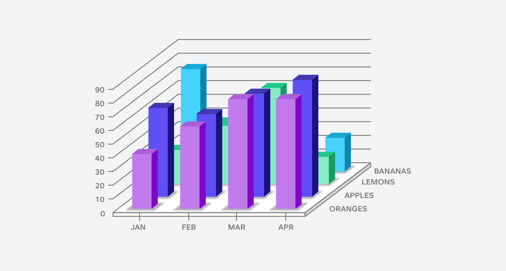

# Data Visualization

## Assignment 2: Good and Bad Data Visualization

### Requirements:

- Data visualizations are important tools for communication and convincing; we need to be able to evaluate the ways that data are presented in visual form to be critical consumers of information 
- To test your evaluation skills, locate two public data visualizations online, one good and one bad  
    - You can find data visualizations at https://public.tableau.com/app/discover or https://datavizproject.com/, or anywhere else you like! 
- For each visualization (good and bad):  
    - Explain (with reference to material covered up to date, along with readings and other scholarly sources, as needed) why you classified that visualization the way you did.
      
## GOOD DATA VIZ: https://selfiecity.net/selfiexploratory/
The Selfiecity visualization is a good example of how data can be presented well. It shows interesting insights about how people take selfies in different cities and among different groups
Why is it Good?
Aesthetic Quality: The design is clean and easy to understand. The grid layout and color coding help organize the information clearly. Using selfies alongside graphs makes it feel more personal and engaging.

Substantive Quality: The data is shown accurately and clearly. It’s easy to follow, with clear labels and explanations for each graph. The ability to filter by things like age, gender, and city adds value, allowing users to explore the data in different ways.

Perceptual Quality: The interactive features are one of the best parts. Users can filter by city, age, or gender to see patterns in the data. Hovering over parts of the visualization for more details helps users understand the data better. The way the data is presented also tells a story about how people take selfies in different places and demographics.

Reproducibility: The process of how the data was collected and analyzed is well-documented. This makes it easy for others to understand and even recreate the study if they want to, which helps make the findings more reliable.

## How could this data visualization have been improved? 
Improve Accessibility: To make the visualization more accessible, it would help to add alt text for images and use colorblind-friendly color palettes. Making sure that interactive elements work with just a keyboard would also help users who can’t use a mouse.

Add More Context: Including tooltips (pop-up explanations) and a section with key insights would help users quickly understand the main takeaways. This would be especially useful for people who don’t want to explore everything but still want to learn the key points.

Enhance Reproducibility: It would be great to have a link to the raw data and share the code used to create the visualizations. This would allow other people to recreate or build on the analysis.

Improve Data Storytelling: Adding a guided feature or story that walks users through the data would help people better understand the key insights. Using bold text or arrows to point out important findings would make the data easier to follow.

Ethical Considerations: It’s important to include a privacy disclaimer about how the data was collected. Making sure that the project follows privacy laws, like GDPR, and clearly stating how the data was used will help build trust and ensure everything is done ethically.

## Bad Data Viz:   
The provided visualization is a poor example of data visualization due to several key issues in its aesthetic, substantive, and perceptual qualities. Below is an analysis of the main problems and suggestions for improvement.

Aesthetic Quality:
Cluttered Design: The visualization is overly busy, with too many elements competing for attention. This makes it hard for users to focus on the key message.
Poor Color Choices: Bright, clashing colors (e.g., neon green, pink, blue) create a visually overwhelming effect. The lack of a cohesive color scheme reduces readability and distracts from the data.
Unclear Hierarchy: There’s no clear visual hierarchy, making it difficult to differentiate between important and secondary information. This leads to important data points being lost in the clutter.

Substantive Quality:
Misleading Representation: The use of disproportionately large icons or images exaggerates certain data points, which can mislead viewers about the actual values or trends.
Lack of Context: The visualization lacks explanations of what the data represents and how it was collected. Important details, such as units of measurement or time frames, are missing, making it hard to interpret the data accurately.
Inconsistent Scales: If any graphs are used, the scales are inconsistent or unclear, which can lead to misinterpretation of the data.

Perceptual Quality:
Confusing Layout: The layout is disorganized, without a clear structure or flow. Users are left uncertain about where to start or how to navigate the information.
No Clear Story: The visualization lacks a clear message or narrative. It doesn’t focus on communicating a specific insight, which can confuse viewers about the purpose of the data.

Reproducibility:
No Data Source or Methodology: There is no mention of where the data comes from or how it was analyzed. This lack of transparency undermines the credibility of the visualization and makes it impossible to reproduce the findings.
  
## How could this data visualization have been improved?  
Simplify the Design:
Use a cohesive color scheme with muted, complementary colors to improve readability and create a visual hierarchy.

Add Context and Labels:
Include clear titles, axis labels, and legends to explain what the data represents.
Add a brief description of the data source and methodology to increase transparency.
Use consistent scales and units of measurement to avoid confusion.

Improve Layout and Flow:
Organize the visualization with a logical flow, using headings and sections to guide users through the data.
Highlight key trends or data points with visual cues like bold text or contrasting colors to draw attention to important insights.

Tell a Clear Story:
Focus on conveying a specific message or insight, and add annotations or tooltips to explain trends, anomalies, or interesting patterns in the data.
Provide a summary or narrative section to help users quickly grasp the key takeaways.

Enhance Accessibility:
Use images to ensure the visualization is colorblind-friendly.
Implement keyboard navigation for interactive elements and optimize the design for mobile devices.

Ensure Ethical Representation:
Include a privacy disclaimer if the data involves personal information and ensure compliance with ethical guidelines  
      

- Word count should not exceed (as a maximum) 500 words for each visualization (i.e. 
300 words for your good example and 500 for your bad example)

### Why am I doing this assignment?:

- This assignment ensures active participation in the course, and assesses the learning outcomes
* Apply general design principles to create accessible and equitable data visualizations
* Use data visualization to tell a story

### Rubric:

| Component               | Scoring   | Requirement                                                 |
|-------------------------|-----------|-------------------------------------------------------------|
| Data viz classification and justification | Complete/Incomplete | - Data viz are clearly classified as good or bad - At least three reasons for each classification are provided - Reasoning is supported by course content or scholarly sources |
| Suggested improvements  | Complete/Incomplete | - At least two suggestions for improvement - Suggestions are supported by course content or scholarly sources |

## Submission Information

🚨 **Please review our [Assignment Submission Guide](https://github.com/UofT-DSI/onboarding/blob/main/onboarding_documents/submissions.md)** 🚨 for detailed instructions on how to format, branch, and submit your work. Following these guidelines is crucial for your submissions to be evaluated correctly.

### Submission Parameters:
* Submission Due Date: `23:59 - 02/03/2025`
* The branch name for your repo should be: `assignment-2`
* What to submit for this assignment:
    * This markdown file (assignment_2.md) should be populated and should be the only change in your pull request.
* What the pull request link should look like for this assignment: `https://github.com/<your_github_username>/visualization/pull/<pr_id>`
    * Open a private window in your browser. Copy and paste the link to your pull request into the address bar. Make sure you can see your pull request properly. This helps the technical facilitator and learning support staff review your submission easily.

Checklist:
- [ ] Create a branch called `assignment-2`.
- [ ] Ensure that the repository is public.
- [ ] Review [the PR description guidelines](https://github.com/UofT-DSI/onboarding/blob/main/onboarding_documents/submissions.md#guidelines-for-pull-request-descriptions) and adhere to them.
- [ ] Verify that the link is accessible in a private browser window.

If you encounter any difficulties or have questions, please don't hesitate to reach out to our team via our Slack. Our Technical Facilitators and Learning Support staff are here to help you navigate any challenges.
